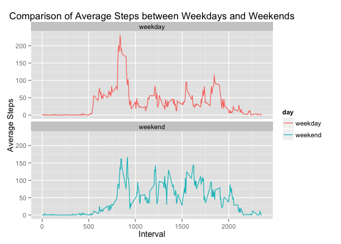

# Reproducible Research: Peer Assessment 1

---

## Loading and preprocessing the data


```
## 
## Attaching package: 'dplyr'
## 
## The following objects are masked from 'package:plyr':
## 
##     arrange, count, desc, failwith, id, mutate, rename, summarise,
##     summarize
## 
## The following object is masked from 'package:stats':
## 
##     filter
## 
## The following objects are masked from 'package:base':
## 
##     intersect, setdiff, setequal, union
## 
## 
## Attaching package: 'lubridate'
## 
## The following object is masked from 'package:plyr':
## 
##     here
```

**Load the Data and remove the missing values in the dataset**


```r
unzip("./activity.zip", exdir = "./")
origActivity = read.csv("./activity.csv")
activity = subset(origActivity, !is.na(steps))
activityNA = subset(origActivity, is.na(steps))
#timeInterval = str_pad(str_pad(activity$interval, 4, side = "left", pad = "0"), 6, side="right", "0")
#activity$dateTimeInterval = ymd_hms(paste(activity$date, timeInterval , " "))
activity$date = ymd(activity$date)
origActivity$date = ymd(origActivity$date)
```

**Take a look at the Structure of the Data**


```r
str(activity)
```

```
## 'data.frame':	15264 obs. of  3 variables:
##  $ steps   : int  0 0 0 0 0 0 0 0 0 0 ...
##  $ date    : POSIXct, format: "2012-10-02" "2012-10-02" ...
##  $ interval: int  0 5 10 15 20 25 30 35 40 45 ...
```


**Summary of the Data**


```r
summary(activity)
```

```
##      steps             date                        interval     
##  Min.   :  0.00   Min.   :2012-10-02 00:00:00   Min.   :   0.0  
##  1st Qu.:  0.00   1st Qu.:2012-10-16 00:00:00   1st Qu.: 588.8  
##  Median :  0.00   Median :2012-10-29 00:00:00   Median :1177.5  
##  Mean   : 37.38   Mean   :2012-10-30 17:12:27   Mean   :1177.5  
##  3rd Qu.: 12.00   3rd Qu.:2012-11-16 00:00:00   3rd Qu.:1766.2  
##  Max.   :806.00   Max.   :2012-11-29 00:00:00   Max.   :2355.0
```

**First 5 rows of the Data**

```r
head(activity)
```

```
##     steps       date interval
## 289     0 2012-10-02        0
## 290     0 2012-10-02        5
## 291     0 2012-10-02       10
## 292     0 2012-10-02       15
## 293     0 2012-10-02       20
## 294     0 2012-10-02       25
```

---

## What is mean total number of steps taken per day?

**Total number of steps taken per day**


```r
totalDailySteps = ddply(activity, "date", summarize, totalSteps=sum(steps))
totalDailySteps
```

```
##          date totalSteps
## 1  2012-10-02        126
## 2  2012-10-03      11352
## 3  2012-10-04      12116
## 4  2012-10-05      13294
## 5  2012-10-06      15420
## 6  2012-10-07      11015
## 7  2012-10-09      12811
## 8  2012-10-10       9900
## 9  2012-10-11      10304
## 10 2012-10-12      17382
## 11 2012-10-13      12426
## 12 2012-10-14      15098
## 13 2012-10-15      10139
## 14 2012-10-16      15084
## 15 2012-10-17      13452
## 16 2012-10-18      10056
## 17 2012-10-19      11829
## 18 2012-10-20      10395
## 19 2012-10-21       8821
## 20 2012-10-22      13460
## 21 2012-10-23       8918
## 22 2012-10-24       8355
## 23 2012-10-25       2492
## 24 2012-10-26       6778
## 25 2012-10-27      10119
## 26 2012-10-28      11458
## 27 2012-10-29       5018
## 28 2012-10-30       9819
## 29 2012-10-31      15414
## 30 2012-11-02      10600
## 31 2012-11-03      10571
## 32 2012-11-05      10439
## 33 2012-11-06       8334
## 34 2012-11-07      12883
## 35 2012-11-08       3219
## 36 2012-11-11      12608
## 37 2012-11-12      10765
## 38 2012-11-13       7336
## 39 2012-11-15         41
## 40 2012-11-16       5441
## 41 2012-11-17      14339
## 42 2012-11-18      15110
## 43 2012-11-19       8841
## 44 2012-11-20       4472
## 45 2012-11-21      12787
## 46 2012-11-22      20427
## 47 2012-11-23      21194
## 48 2012-11-24      14478
## 49 2012-11-25      11834
## 50 2012-11-26      11162
## 51 2012-11-27      13646
## 52 2012-11-28      10183
## 53 2012-11-29       7047
```

**histogram of the total number of steps taken each day**


```r
ggplot(totalDailySteps, aes(x=totalSteps)) +
        geom_histogram(binwidth=2500, fill="green", colour="black") +
        ggtitle("Histogram of Total Daily Steps without NA's") +
        xlab("Total Daily Steps") + ylab("Frequency")
```

 

**mean and median of the total number of steps taken per day**


```r
mean(totalDailySteps$totalSteps)
```

```
## [1] 10766.19
```

```r
median(totalDailySteps$totalSteps)
```

```
## [1] 10765
```

## What is the average daily activity pattern?

**Time series plot of the 5-minute interval (x-axis) and the average number of steps taken, averaged across all days (y-axis)**


```r
stepsAvgByInterval = ddply(activity, "interval", summarize, avgSteps=mean(steps))
plot(stepsAvgByInterval$interval, stepsAvgByInterval$avgSteps, type="l", col="red", ylab="Average Steps", xlab="Interval", main="Average Steps by Interval")
```

 

**5-minute interval, on average across all the days in the dataset, contains the maximum number of steps**


```r
stepsAvgByInterval[stepsAvgByInterval$avgSteps == max(stepsAvgByInterval$avgSteps), ]
```

```
##     interval avgSteps
## 104      835 206.1698
```

---

## Imputing missing values

**total number of missing values in the dataset (i.e. the total number of rows with NAs)**

```r
nrow(activityNA)
```

```
## [1] 2304
```

**strategy for filling in all of the missing values in the dataset, using the mean for that 5-minute interval**

using tidyr to spread the intervals into variables, impute the data with mean for that interval and then gather back to its original form into imputedActivity 


```r
library(Hmisc)
```

```
## Loading required package: grid
## Loading required package: lattice
## Loading required package: survival
## Loading required package: splines
## Loading required package: Formula
## 
## Attaching package: 'Hmisc'
## 
## The following objects are masked from 'package:dplyr':
## 
##     combine, src, summarize
## 
## The following objects are masked from 'package:plyr':
## 
##     is.discrete, summarize
## 
## The following objects are masked from 'package:base':
## 
##     format.pval, round.POSIXt, trunc.POSIXt, units
```

```r
temp = spread(origActivity, interval, steps)
names = colnames(temp)
for (name in names) {
    temp[, name] = impute(temp[, name], mean)
}

imputedActivity = gather(temp, interval, steps, -date)
imputedActivity$interval = as.numeric(as.character(imputedActivity$interval))
str(imputedActivity)
```

```
## 'data.frame':	17568 obs. of  3 variables:
##  $ date    : POSIXct, format: "2012-10-01" "2012-10-02" ...
##  $ interval: num  0 0 0 0 0 0 0 0 0 0 ...
##  $ steps   :Class 'impute'  atomic [1:17568] 1.72 0 0 47 0 ...
##   .. ..- attr(*, "imputed")= int [1:8] 1 8 32 35 40 41 45 61
```

```r
detach(package:Hmisc, unload=TRUE)
```

**Total Steps by day of the imputed dataset**


```r
library(plyr)
imputedTotalDailySteps = ddply(imputedActivity, "date", summarize, totalSteps=sum(steps))
imputedTotalDailySteps
```

```
##          date totalSteps
## 1  2012-10-01   10766.19
## 2  2012-10-02     126.00
## 3  2012-10-03   11352.00
## 4  2012-10-04   12116.00
## 5  2012-10-05   13294.00
## 6  2012-10-06   15420.00
## 7  2012-10-07   11015.00
## 8  2012-10-08   10766.19
## 9  2012-10-09   12811.00
## 10 2012-10-10    9900.00
## 11 2012-10-11   10304.00
## 12 2012-10-12   17382.00
## 13 2012-10-13   12426.00
## 14 2012-10-14   15098.00
## 15 2012-10-15   10139.00
## 16 2012-10-16   15084.00
## 17 2012-10-17   13452.00
## 18 2012-10-18   10056.00
## 19 2012-10-19   11829.00
## 20 2012-10-20   10395.00
## 21 2012-10-21    8821.00
## 22 2012-10-22   13460.00
## 23 2012-10-23    8918.00
## 24 2012-10-24    8355.00
## 25 2012-10-25    2492.00
## 26 2012-10-26    6778.00
## 27 2012-10-27   10119.00
## 28 2012-10-28   11458.00
## 29 2012-10-29    5018.00
## 30 2012-10-30    9819.00
## 31 2012-10-31   15414.00
## 32 2012-11-01   10766.19
## 33 2012-11-02   10600.00
## 34 2012-11-03   10571.00
## 35 2012-11-04   10766.19
## 36 2012-11-05   10439.00
## 37 2012-11-06    8334.00
## 38 2012-11-07   12883.00
## 39 2012-11-08    3219.00
## 40 2012-11-09   10766.19
## 41 2012-11-10   10766.19
## 42 2012-11-11   12608.00
## 43 2012-11-12   10765.00
## 44 2012-11-13    7336.00
## 45 2012-11-14   10766.19
## 46 2012-11-15      41.00
## 47 2012-11-16    5441.00
## 48 2012-11-17   14339.00
## 49 2012-11-18   15110.00
## 50 2012-11-19    8841.00
## 51 2012-11-20    4472.00
## 52 2012-11-21   12787.00
## 53 2012-11-22   20427.00
## 54 2012-11-23   21194.00
## 55 2012-11-24   14478.00
## 56 2012-11-25   11834.00
## 57 2012-11-26   11162.00
## 58 2012-11-27   13646.00
## 59 2012-11-28   10183.00
## 60 2012-11-29    7047.00
## 61 2012-11-30   10766.19
```

**histogram of the total number of steps taken each day of the imputed dataset**


```r
ggplot(imputedTotalDailySteps, aes(x=totalSteps)) +
        geom_histogram(binwidth=2500, fill="green", colour="black") +
        ggtitle("Histogram of Total Daily Steps of the Imputed Dataset") +
        xlab("Total Daily Steps") + ylab("Frequency")
```

 

**mean and median of the total number of steps taken per day of the imputed dataset**


```r
mean(imputedTotalDailySteps$totalSteps)
```

```
## [1] 10766.19
```

```r
median(imputedTotalDailySteps$totalSteps)
```

```
## [1] 10766.19
```

**Do these values differ from the estimates from the first part of the assignment? What is the impact of imputing missing data on the estimates of the total daily number of steps?**


```r
totalDailySteps$imputed = "Not Imputed"
imputedTotalDailySteps$imputed="Imputed"
finalTotalDailySteps = rbind(totalDailySteps, imputedTotalDailySteps)
ggplot(finalTotalDailySteps, aes(x=totalSteps)) +
        geom_histogram(binwidth=2500, fill="green", colour="black") +
        facet_grid(. ~ imputed) +
        ggtitle("Histogram comparison of Total Daily Steps between non imputed and imputed dataset") +
        xlab("Total Daily Steps") + ylab("Frequency")
```

 

---

## Are there differences in activity patterns between weekdays and weekends?

**Create a new factor variable in the dataset with two levels – “weekday” and “weekend” indicating whether a given date is a weekday or weekend day**

```r
imputedActivity$day = ifelse(grepl("Saturday|Sunday", weekdays(imputedActivity$date), ignore.case = FALSE), "weekend", "weekday")
imputedActivity$day = as.factor(imputedActivity$day)
table(imputedActivity$day)
```

```
## 
## weekday weekend 
##   12960    4608
```
**Panel plot containing a time series plot (i.e. type = "l") of the 5-minute interval (x-axis) and the average number of steps**


```r
stepsAvgByIntervalDay = ddply(imputedActivity, c("interval", "day"), summarize, avgSteps=mean(steps))

ggplot(stepsAvgByIntervalDay, aes(x=interval, y=avgSteps, color=day)) +
    geom_line() +
    facet_wrap(~ day, ncol=1) +
    xlab("Interval") +
    ylab("Average Steps") +
    ggtitle("Comparison of Average Steps between Weekdays and Weekends")
```

 


